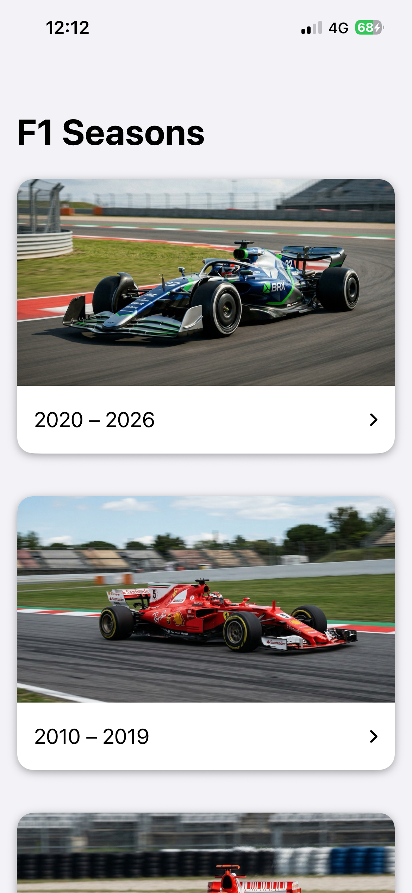
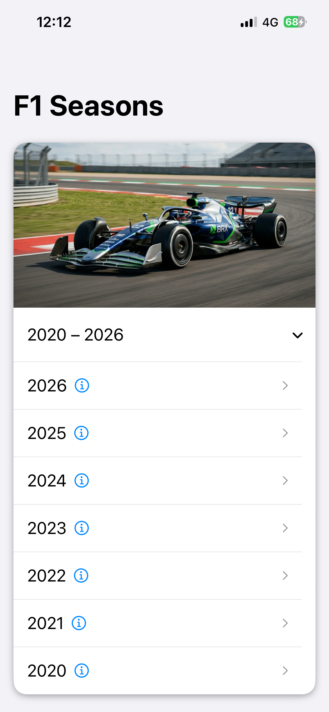
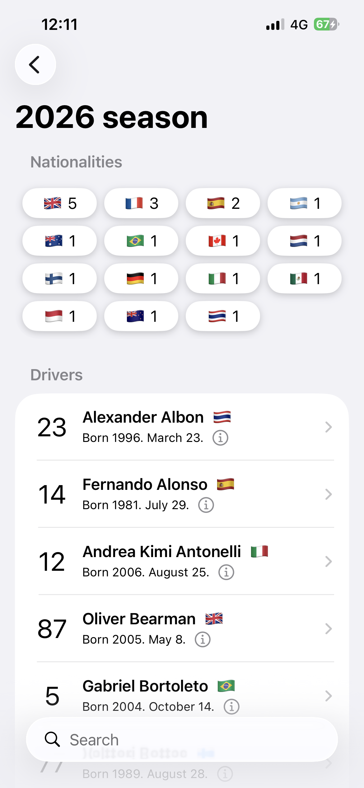
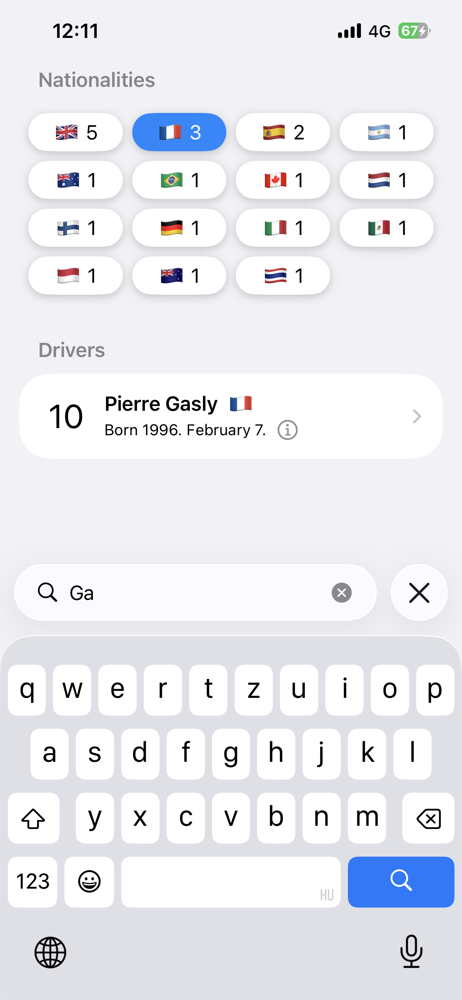
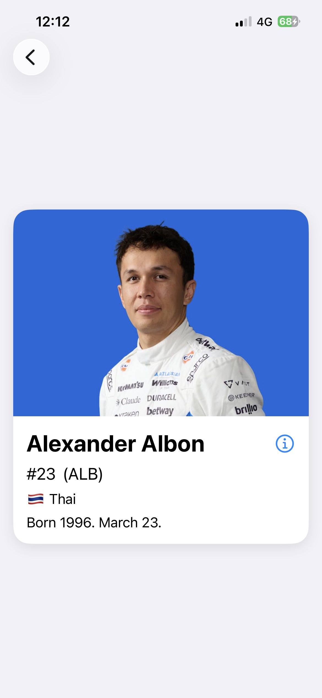

# WebstarF1App

A Formula 1 history browser for iOS — browse every season from 1950 to today, explore driver lineups, and view detailed driver profiles with photos.

## Screenshots

| Seasons | Season (expanded) | Drivers | Filtering | Driver Profile |
|---|---|---|---|---|
|  |  |  |  |  |

## Build

- **Xcode 26.3+**
- **iOS 26.2+**
- No third-party dependencies — pure SwiftUI + URLSession

Open `WebstarF1App.xcodeproj` and run.

## Architecture

MVVM with a generic `ViewState<T>` enum for state management. One ViewModel per screen, a shared `F1APIService` with a generic `fetch<T: Decodable>` function for networking.

See [DECISIONS.md](DECISIONS.md) for detailed reasoning behind every architectural choice.

## API

- F1 data: [Ergast API mirror](https://api.jolpi.ca/ergast/f1/)
- Driver images: Google Custom Search API

## Known Limitations

- The 1952 season has 105 drivers. The current `?limit=105` covers this, but a proper pagination implementation would be more robust for future edge cases.
